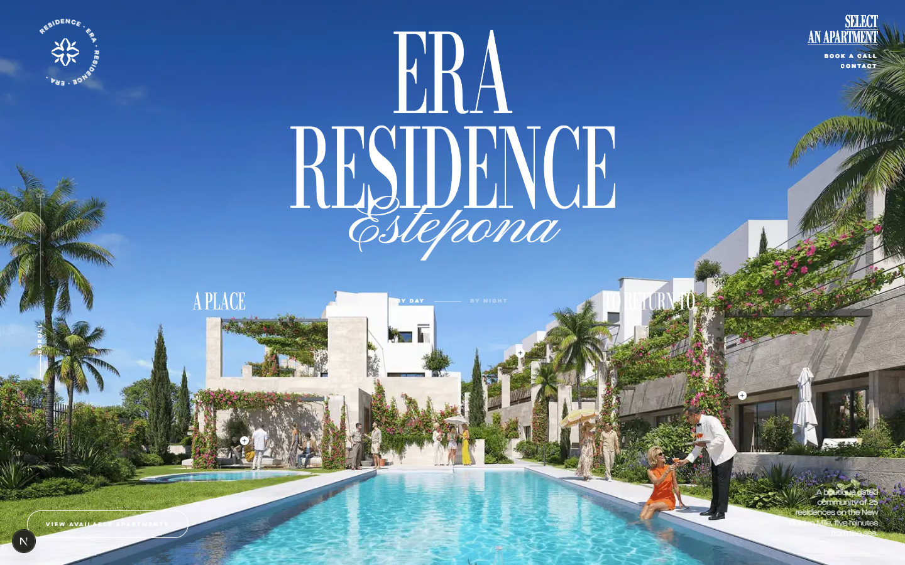
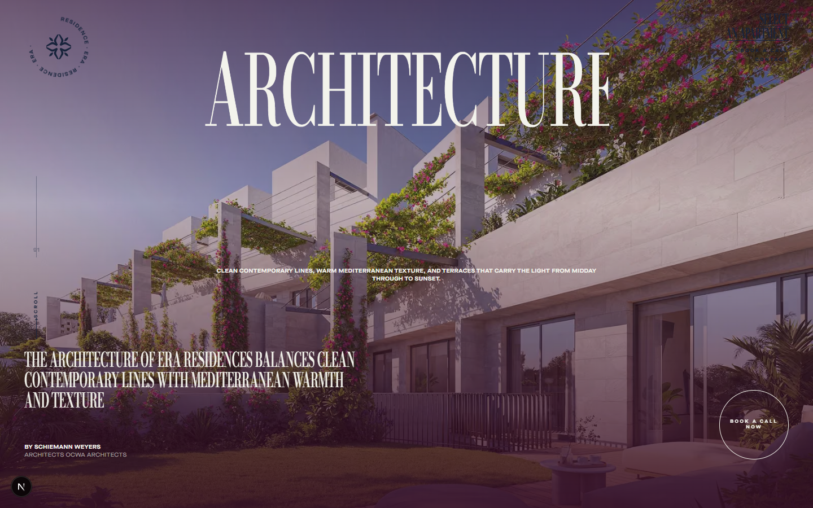
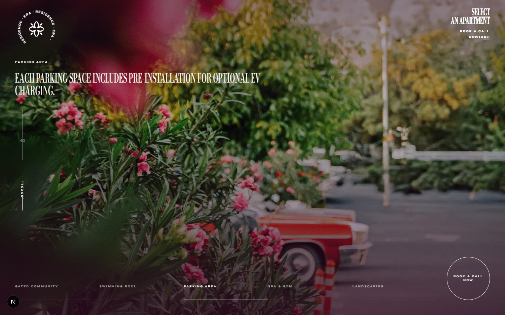
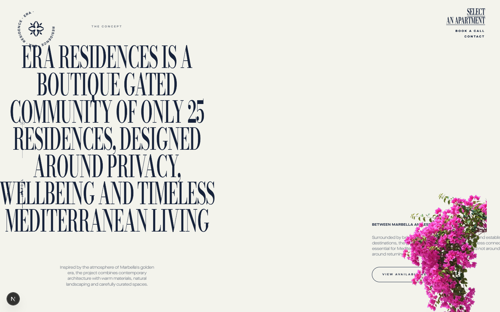
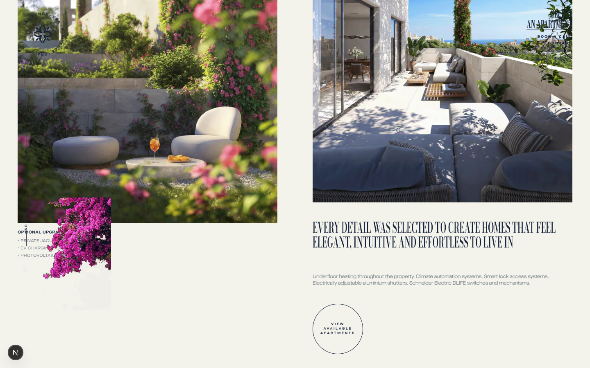
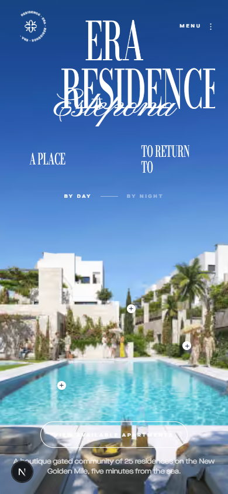

<div align="center">

# MARQUIS LIVING — Frontend

### A luxury real-estate web experience, built from scratch

*Cinematic scroll choreography · GSAP timelines · Lenis smooth scroll · A fully fluid design system*

<br />


<br />



</div>

---

## Author

**Harsh Singh** — *Frontend Website Designer & Developer*

[](https://github.com/HaRsH00000007)

I designed and built the entire frontend of this website. Every line of it is mine —
the design system, the scroll choreography, the GSAP timelines, the responsive
strategy, the component architecture, and the QA passes that took it from
*approximately right* to *pixel-accurate*.

This is an independent recreation of the [era-residence.com](https://www.era-residence.com/)
frontend experience, rebuilt from scratch as a modern React application. No source was
copied — behaviour was observed in a real browser and reimplemented. Original branding
and imagery belong to ERA Residence and appear here only for this reconstruction.

---

## Gallery

<table>
<tr>
<td width="50%"></td>
<td width="50%"></td>
</tr>
<tr>
<td align="center"><i>Architecture — full-bleed video with a scroll-driven palette shift</i></td>
<td align="center"><i>Amenities — pinned horizontal tabs over looping video</i></td>
</tr>
<tr>
<td width="50%"></td>
<td width="50%"></td>
</tr>
<tr>
<td align="center"><i>The Concept — fluid display type at 12vw</i></td>
<td align="center"><i>Interiors — editorial two-column grid</i></td>
</tr>
</table>

<div align="center">

<br />
<i>The same choreography, rebuilt for touch — not a stripped-down fallback</i>
</div>

---

## What went into it

**Scroll choreography.** GSAP ScrollTrigger drives twelve scroll-linked sequences —
a hero that zooms and cross-dissolves between day and night, pinned sections that scrub
horizontally, apartment tabs that advance with scroll position, and reveal timelines
per section. Lenis provides the lerped scroll position that every pinned section reads from.

**One rAF loop, not three.** Lenis is driven off the GSAP ticker with `ScrollTrigger.update`
wired into its scroll event and `lagSmoothing(0)` set, so smooth scroll, ScrollTrigger and
every tween share a single animation frame instead of competing for it.

**A page-wide colour ground.** A fixed canvas behind the entire document paints a gradient
assembled from the sections' own `data-canvas` tokens, dissolving between palettes across a
band of the page rather than at a hard edge. It is written directly from a rAF-throttled
scroll handler — it never re-renders React.

**A fluid design system.** The entire responsive strategy is `html { font-size: 1vw }`, so
`1rem` is always 1% of the viewport width and every size token scales continuously instead
of snapping at breakpoints:

```css
--scale-ratio: 16;                 /* desktop canvas 1600px */
--scale-ratio: 4.16;               /* <=991px canvas 416px  */
--h1-size: calc(192 * var(--u));   /* = 12vw on desktop */
```

Colour and ink come from a semantic layer (`--ink`, `--line`, `--bg`) that `theme_on-*`
classes remap, so any component works correctly inside any section.

**Performance held as a constraint, not an afterthought.** Every page prerenders to static
HTML. Videos are `preload="none"` and mount only when an IntersectionObserver says they are
near the viewport. Images ship as AVIF/WebP through `next/image` with poster frames behind
every video. `prefers-reduced-motion` disables smooth scroll and the scroll-linked motion
entirely. The client bundle is ~1.1 MB of static JS, largest chunk 224 KB.

---

## Stack

| | |
| --- | --- |
| **Framework** | Next.js 16 (App Router), React 19 |
| **Language** | TypeScript |
| **Styling** | CSS Modules, custom-property design tokens |
| **Animation** | GSAP + ScrollTrigger + CustomEase |
| **Scroll** | Lenis, driven from the GSAP ticker |
| **Media** | `next/image` (AVIF/WebP), WebM video with poster frames |
| **Rendering** | Fully static — no server functions, no cold starts |

---

## Running it locally

```bash
git clone https://github.com/HaRsH00000007/MARQUIS_LIVING_Frontend.git
cd MARQUIS_LIVING_Frontend

npm install
npm run dev          # http://localhost:3000
```

```bash
npm run build && npm start   # production build — animation is noticeably
                             # smoother here than in dev
npm run lint
```

> **Note:** judge the motion from a production build. `next dev` runs unminified with
> React's double-invoked effects under `reactStrictMode`, which makes scroll-linked
> animation look choppier than it actually is.

---

## Deploying

The app is fully static and deploys to Vercel with no configuration:

1. **New Project** → import `HaRsH00000007/MARQUIS_LIVING_Frontend`
2. Framework preset is detected as **Next.js** — leave every setting at its default
3. No environment variables are required
4. **Deploy**

There are no server functions, so there are no cold starts and nothing to configure at
runtime. Worth knowing: `public/` carries ~66 MB of video and imagery, which counts toward
your Vercel bandwidth allowance rather than against render performance.

---

## Project structure

```
app/          routes, metadata, robots, sitemap
components/   Header, ScrollRail, Preloader, PageCanvas, modals, consent
  sections/   one component per page section
  ui/         Reveal, Buttons, Pagination, EraMark, FlowerVideo, Icons
  marquis/    the Marquis Living view — shell, loader, split hero, motion
hooks/        reveal, media query, slider, horizontal pin, scroll tabs, drag pan, theme probe
lib/          typed content, motion tokens, hero curves, gsap setup
styles/       tokens · typography · components
public/       images, videos, icons, fonts, lottie
docs/         analysis, asset inventory, component map, QA write-ups
tools/        reconnaissance and QA scripts (not part of the build)
```

---

## Documentation

The build was documented as it went. These are the working notes:

| File | Contents |
| --- | --- |
| [`docs/reference-analysis.md`](docs/reference-analysis.md) | Stack, design tokens, section inventory, animation and interaction catalogue |
| [`docs/component-map.md`](docs/component-map.md) | Section → component → responsibility |
| [`docs/network-assets.md`](docs/network-assets.md) | Network capture, loading strategy, critical assets |
| [`docs/assets.md`](docs/assets.md) | Full asset inventory, origins, optimisation, **font licensing** |
| [`docs/browser-vs-download.md`](docs/browser-vs-download.md) | Browser observation vs. HTTP snapshot, and where they disagreed |
| [`docs/visual-qa.md`](docs/visual-qa.md) | Every defect found and fixed, with severity and status |
| [`docs/transition-qa.md`](docs/transition-qa.md) | Scroll transition and animation QA |
| [`docs/final-qa.md`](docs/final-qa.md) | What was implemented, known differences, technical notes |

---

## Licensing

The code is MIT licensed — see [`LICENSE`](LICENSE).

The **content is not**. Imagery and branding belong to ERA Residence and are present only
for this reconstruction. The display and script typefaces are free substitutes for two
Adobe Fonts families that cannot be redistributed, and Maison Neue Extended is commercially
licensed. Read [`docs/assets.md`](docs/assets.md) before putting this in front of anyone.

---

<div align="center">

**Built by [Harsh Singh](https://github.com/HaRsH00000007)** — Frontend Website Designer & Developer

</div>
